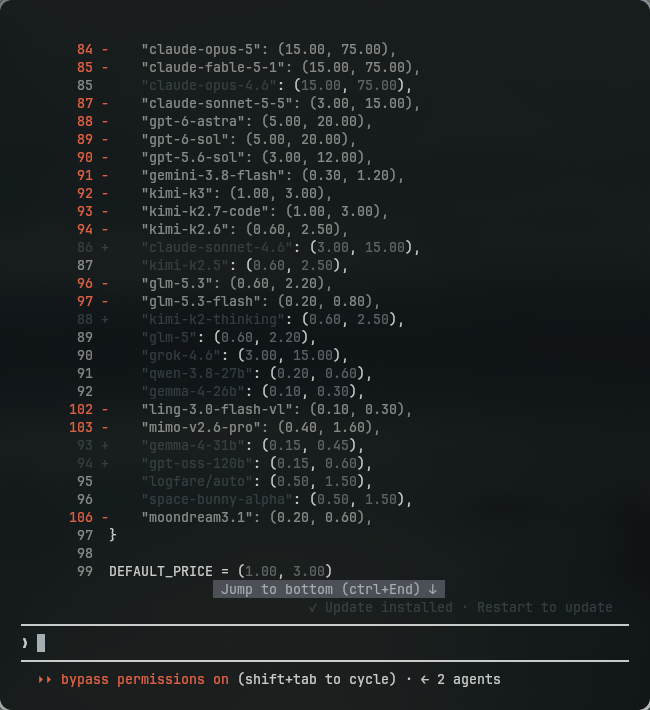
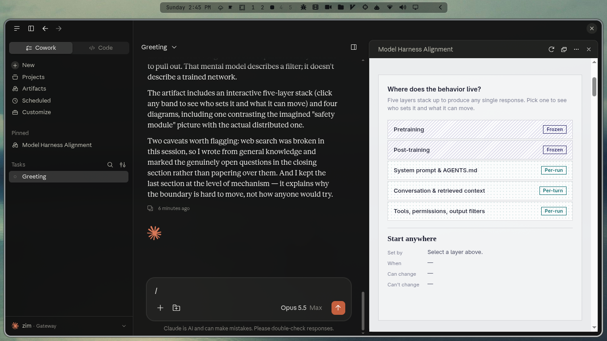
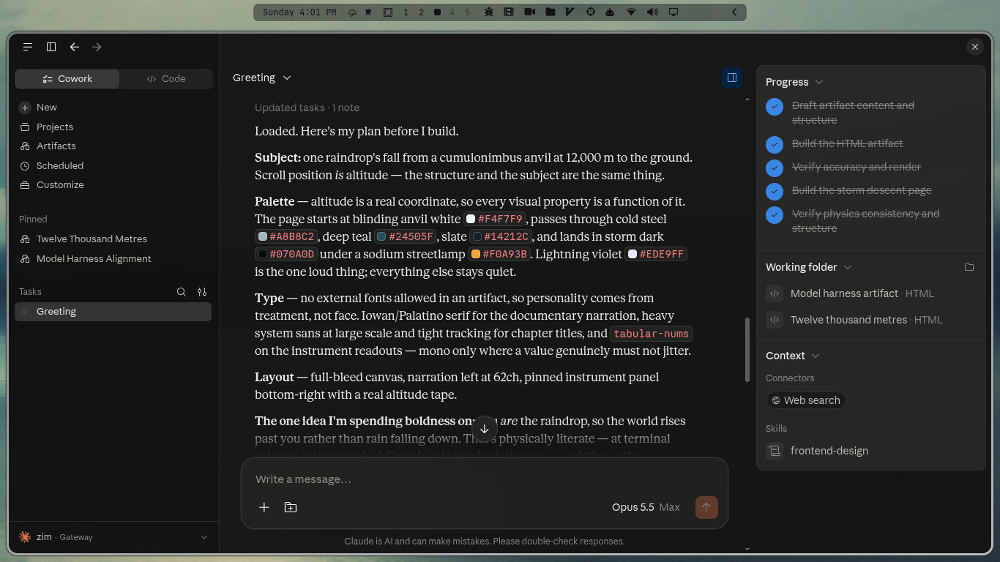
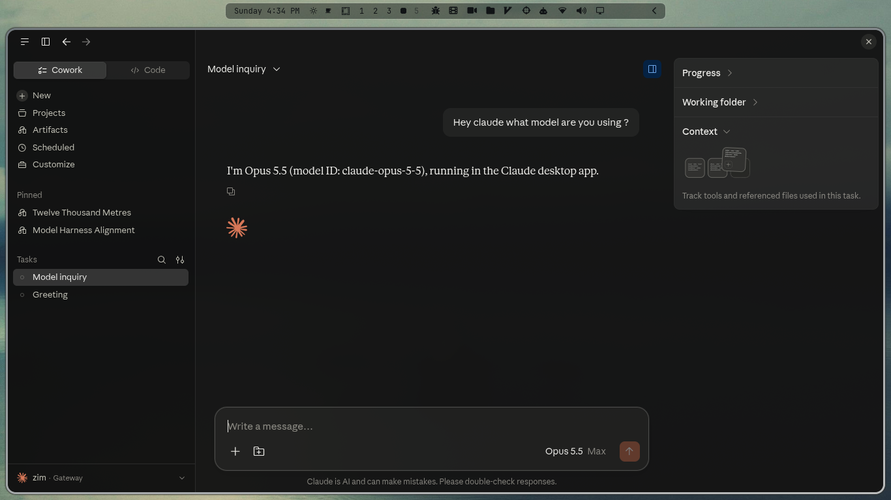

<div align="center">

<h1>zim-claude</h1>

<p><strong>Claude Code, pointed at a local LiteLLM proxy.</strong></p>

<p>Same flags, same subcommands, same interactive UI as <code>claude</code> —<br>
it just talks to a proxy on <code>localhost:4000</code> instead of Anthropic.</p>

<p>
<a href="#install"></a>
<a href="#the-proxy"></a>
<a href="#claude-desktop--the-zim-gateway"></a>
</p>



</div>

---

## What it is

A drop-in replacement for `claude`. Every flag and subcommand passes through untouched:

```bash
zim-claude                                  # interactive session
zim-claude --dangerously-skip-permissions   # any claude flag works
zim-claude -p "explain this function"       # non-interactive
zim-claude mcp list                         # any claude subcommand works
zim-claude mcp add demo -- npx -y some-mcp  # arguments pass through untouched
```

The proxy starts automatically the first time you use it, and the health check costs
about 8 ms once it is already up.

```
  Claude Code  ──▶  LiteLLM :4000  ──▶  Token Juice  ──▶  upstream
   zim-claude          (local)                            (model)
```

---

## Install

<table>
<tr><th align="left">Linux · macOS · WSL</th><th align="left">Windows</th></tr>
<tr><td>

<pre><code>git clone &lt;this repo&gt; zim-claude
cd zim-claude
./install.sh</code></pre>

</td><td>

<pre><code>git clone &lt;this repo&gt; zim-claude
cd zim-claude\windows
win-install.bat</code></pre>

</td></tr>
</table>

That's it. Open a new terminal and run `zim-claude`.

### Which installer do I run?

| Installer | Platform | What it sets up | Run it with |
|---|---|---|---|
| `install.sh` | Linux · macOS · WSL | CLI proxy `:4000` + the `zim-claude` command | `./install.sh` |
| `windows\win-install.bat` | Windows | **both** proxies — `:4000` *and* the `:4002` gateway — plus `zim-claude` | `win-install.bat` |
| `claude-desktop-integration/install.sh` | Linux · macOS | the `:4002` gateway only | `cd claude-desktop-integration && ./install.sh` |

You normally only need the first one for your platform. The third exists for people who
want the Claude Desktop gateway without the CLI side.

> **On Windows, `win-install.bat` is the entry point** — it forwards every flag to
> `win-install.ps1`, which holds the logic. It is a `.bat` so it can be double-clicked
> and so it still runs when the machine's execution policy would refuse a bare `.ps1`.

---

## Requirements

The installer checks for each of these and offers to install anything missing.
**Nothing is installed without you answering `y`.**

| Tool | If missing |
|---|---|
| `bash`, `curl`, `base64` | required — the installer reports and exits |
| Claude Code (`claude`) | offers `curl -fsSL https://claude.ai/install.sh \| bash` |
| `litellm` | offers to build a private virtualenv containing it |

**You do not need litellm, pip, or a writable system Python.** If no `litellm` is
found, the installer creates a virtualenv at `~/.local/share/zim-claude/venv` and
installs `litellm[proxy]` and `uvloop` into it. Nothing is activated by hand and no
`--break-system-packages` is involved. If you already have a `litellm` on `PATH` or in
`~/.local/bin`, it is reused and no venv is built.

Claude Code uses Anthropic's official installer rather than `npm install -g`: no Node
dependency, and it sets up the launcher and shell integration itself. It is run
**without sudo** — it installs under `$HOME` and exits with an explicit error if it
detects sudo, so running it under sudo would guarantee failure.

<details>
<summary><b>If <code>python3</code> has no <code>pip</code> or no <code>venv</code></b></summary>

Neither is needed. `python3 -m venv` bootstraps its own `pip` from `ensurepip`, so a
Python with no system pip still builds the proxy venv — this is the default on Arch,
where `python` ships without pip. The old advice here (`python3 -m pip install ...`)
failed with `No module named pip` and installed nothing; the venv path avoids that
entirely.

`venv` itself is the one thing that must be present. Debian/Ubuntu split it out of the
interpreter package, and the installer detects that and names the fix:

| Platform | If `python3 -m venv` is missing |
|---|---|
| Debian/Ubuntu | `sudo apt install python3-venv` |

`pipx install 'litellm[proxy]'` also works if you prefer it — `start-litellm.sh` uses
whatever litellm it finds first, so a pipx install is picked up and no venv is built.

</details>

<details>
<summary><b><code>zim-claude: command not found</code> right after installing</b></summary>

The installer is a subprocess and cannot change the `PATH` of the shell that launched it.
A new terminal picks up `~/.local/bin` automatically; to fix the shell you are already in:

```bash
export PATH="$HOME/.local/bin:$PATH"
```

(`hash -r` will not help — it clears bash's command-lookup cache and never adds a
directory to `PATH`.)

</details>

### What it puts where

| Path | Purpose |
|---|---|
| `~/.local/bin/zim-claude` | the command |
| `~/.local/bin/start-litellm.sh` | proxy manager: `start`/`stop`/`restart`/`status`/`logs` |
| `~/claude-source/deepseek-claude` | the env profile (mode 600) |
| `~/litellm-config.yaml` | LiteLLM proxy config |
| `~/.local/share/zim-claude/venv/` | the proxy's private virtualenv (litellm + uvloop) |
| `~/.local/share/zim-claude/` | install state + backups (mode 700) |

Anything it would overwrite is backed up first, under
`~/.local/share/zim-claude/backups/<timestamp>/`.

### Installer flags

```
./install.sh                install
./install.sh --dry-run      print every action, change nothing
./install.sh --uninstall    remove what the installer created
./install.sh --force        overwrite files you have hand-edited (still backs up)
./install.sh --no-rc        don't touch ~/.bashrc
./install.sh --start        start the proxy when done
./install.sh --no-venv      never build the proxy virtualenv
```

Re-running `install.sh` is safe and idempotent — it compares file contents and skips
anything already up to date, and a venv that already holds litellm is left alone.

Building the venv downloads a few hundred megabytes, so it is **asked about, never
assumed**. In a non-interactive run (`curl … | bash`, CI) there is no terminal to ask,
so it is skipped and the installer says so — the CLI half still installs. Re-run
`./install.sh` from a terminal to build it, or use `--no-venv` to skip the question.

`--uninstall` removes the files it installed, but **only if you haven't edited them**,
and never touches your env profile or `~/litellm-config.yaml`. It removes the proxy
virtualenv too — but only one this installer built; a venv you made yourself is left
in place.

---

## Windows

Windows gets its own installer under `windows/`. It is **native** — no WSL, no Git Bash,
no Node, and no Administrator rights.

One installer sets up **both** proxies, because on Windows they are always wanted
together:

| | CLI | Claude Desktop |
|---|---|---|
| Port | `4000` | `4002` |
| Config | `%USERPROFILE%\litellm-config.yaml` | `%USERPROFILE%\.local\share\zim-claude\desktop\litellm-config.desktop.yaml` |
| Log | `%USERPROFILE%\.local\share\zim-claude\logs\cli.log` | `...\logs\desktop.log` |

It installs the same `zim-claude` command you get on Linux, into
`%USERPROFILE%\.local\bin`:

```bat
zim-claude                                  :: interactive session
zim-claude --dangerously-skip-permissions   :: any claude flag works
zim-claude -p "explain this function"       :: non-interactive
zim-claude mcp list                         :: any claude subcommand works
```

The command works identically from `cmd.exe` and from PowerShell. Every argument is
forwarded to `claude.exe` untouched, and its exit code passes through — so
`zim-claude -p "x" && next-step` behaves the way you'd expect.

### Windows flags

```
win-install.bat                 install both sides, start the proxies
win-install.bat -DryRun         print every action, change nothing
win-install.bat -SkipDesktop    CLI proxy (:4000) only
win-install.bat -SkipCli        Claude Desktop gateway (:4002) only
win-install.bat -NoStart        install but don't start the proxies
win-install.bat -Force          overwrite hand-edited files (backed up first)
win-install.bat -Uninstall      remove what the installer created
```

Start with `-DryRun` to review every action before anything changes.

Same guarantees as the Linux installer: it backs up anything it would overwrite,
compares contents so a re-run is a no-op, and **never overwrites your env profile** —
that file holds a live credential, so `-Force` does not apply to it.

### Manage the proxies

`start-proxies` drives both:

```powershell
start-proxies start                 # bring both up
start-proxies status                # is it running?
start-proxies status -Which desktop # just the :4002 gateway
start-proxies gateway               # print the values for the Desktop UI
start-proxies logs                  # tail both logs
start-proxies restart
start-proxies stop
```

Run the command, not the `.ps1` by name. A `.ps1` cannot be executed by name alone
(`.\start-proxies.ps1` is required, and on a Windows client the default `Restricted`
execution policy blocks it anyway). `start-proxies.cmd` is what makes the plain
command work: it passes `-ExecutionPolicy Bypass` for that one invocation, so your
machine's policy is untouched. Every `.ps1` here has such a shim for the same reason.

You normally never need these — `zim-claude` health-checks `localhost:4000` and starts
the CLI proxy if it's down, exactly as on Linux.

### Windows requirements

| Tool | If missing |
|---|---|
| Python 3.10+ | offers `winget install Python.Python.3.12` (litellm is a Python package) |
| `litellm` | offers `python -m pip install --user "litellm[proxy]"` |
| Claude Code | offers Anthropic's native installer, `irm https://claude.ai/install.ps1 \| iex` |

Claude Code on Windows needs **no** WSL, Node, or Administrator rights. It installs to
`%USERPROFILE%\.local\bin\claude.exe`. [Git for Windows](https://git-scm.com/downloads/win)
is optional — Claude Code only needs it for its Bash tool.

`install.sh` at the repo root remains the Linux/macOS/WSL installer and is unchanged.

---

## Claude Desktop — the `zim` gateway

The **zim gateway** provides **free, unlimited Claude Opus 5.5** to Claude Desktop — the
new front-tier Anthropic model, with no per-message limits.

The CLI proxy above steers **Claude Code**. Claude Desktop is a different app, and it
ignores those environment variables: when it spawns its embedded agent it *blanks* them
and injects its own credentials. It only accepts a custom endpoint through
**Third-Party Inference → Gateway**.

So there is a second, independent proxy on `:4002` for it. Separate port, config, log and
PID file — `zim-claude` on `:4000` keeps working untouched.

<div align="center">

<table>
<tr>
<td align="center" valign="top" width="50%">
<br>
<sub>The model picker reads <strong>Opus 5.5 Max</strong>; the status bar reads <strong><code>zim · Gateway</code></strong>.</sub>
</td>
<td align="center" valign="top" width="50%">
<br>
<sub>Cowork sessions, progress tracking and the working-folder panel all work normally.</sub>
</td>
</tr>
</table>



<p><em>Asked which model it is, the session answers with the name the gateway exposes it
under — <code>claude-opus-5-5</code>.</em></p>

</div>

### Set it up

**Windows** — the installer sets up the proxy; you still paste the values into the app
once (Windows has no managed-config file, so there is nothing the installer can write
for you):

```bat
cd windows
win-install.bat
```

Use `-SkipCli` if you want only the `:4002` gateway. The desktop config lands at
`%USERPROFILE%\.local\share\zim-claude\desktop\litellm-config.desktop.yaml`, its log at
`...\logs\desktop.log`. `start-proxies.ps1 gateway` prints the exact values for the
dialog, and `windows\verify.ps1` proves the gateway answers.

> **Use the key `start-proxies.ps1 gateway` prints, not the one in this README.** If
> `CLAUDE_DESKTOP_LITELLM_KEY` is set, the proxy enforces *that* key. A mismatch comes
> back as `{"error":{"message":"No connected db.","type":"no_db_connection"}}` — LiteLLM
> treats an unmatched key as a DB-backed virtual key and there is no DB.

**Linux · macOS** — run the desktop installer:

```bash
cd claude-desktop-integration
./install.sh
```

It starts the proxy and prints the exact values to paste into the app. It does **not**
touch `:4000` or your shell config.

Then, in Claude Desktop:

1. **Help → Troubleshooting → Enable Developer Mode**
2. **Claude menu → Developer → Configure Third-Party Inference…**
3. Connection section:

   | Field | Value |
   |---|---|
   | Inference provider | `Gateway` |
   | Gateway base URL | `http://127.0.0.1:4002` |
   | Gateway API key | `sk-claude-desktop-local` |
   | Gateway auth scheme | `bearer` |

4. **Apply Changes** (older builds: *Apply locally*), then **restart Claude Desktop**.

The picker now lists `claude-opus-5-5`, and every Cowork, Chat and Code model call goes
through LiteLLM.

<details>
<summary><b>No-click alternative (managed config, Linux only)</b></summary>

```bash
./install.sh --managed          # needs sudo -> /etc/claude-desktop/managed-settings.json
./install.sh --uninstall-managed
```

This is the same content as `managed-settings.json`. A managed profile may make the app
show a *managed configuration* notice — that is expected.

**`--managed` has no Windows equivalent here** — it writes to `/etc/` with sudo. On
Windows, use the in-app dialog above.

</details>

### Desktop gateway configuration

| Variable | Default | Meaning |
|---|---|---|
| `CLAUDE_DESKTOP_PORT` | `4002` | proxy port |
| `CLAUDE_DESKTOP_LITELLM_KEY` | `sk-claude-desktop-local` | gateway key (bearer) |
| `CLAUDE_DESKTOP_CONFIG` | `./litellm-config.desktop.yaml` | proxy config |
| `CLAUDE_DESKTOP_LOG` | `/tmp/litellm-desktop.log` | log file |
| `LITELLM_ENV_FILE` | `~/claude-source/deepseek-claude` | profile with the upstream token |

---

## pi — the same gateway, another agent

`zim-pi` runs [pi](https://www.npmjs.com/package/@earendil-works/pi-coding-agent) against
the same `:4002` gateway, so pi and Claude Desktop share one upstream and one config.

```bash
./scripts/zim-pi                              # interactive session
./scripts/zim-pi -p "explain this function"   # any pi flag works
```

Pi speaks OpenAI chat/completions natively, so it needs **no translation layer and no
secret**: it authenticates to the local gateway with the gateway key, and the upstream
token stays inside the proxy's environment where it already lives.

```
  pi  ──▶  LiteLLM :4002  ──▶  Token Juice  ──▶  upstream
 zim-pi       (local)                            (model)
```

**It does not reuse `~/.pi/agent`.** That directory holds your own providers, packages
and default model, and pi writes to it (`/model`, `/autocompact`). `zim-pi` points pi at
its own config dir instead — `~/.local/share/zim-pi/agent`, created on first run and never
overwritten afterwards — so the gateway route cannot clobber your setup, and plain `pi` is
unchanged. Same separation Claude Desktop's `-3p` profile gets.

The generated `models.json` registers one provider, `gateway`, with `apiKey: "$ZIM_PI_KEY"`
— an environment reference, so **no secret is written to disk**. `zim-pi` starts the
proxy if it is down, exactly as `zim-claude` does on `:4000`.

Install pi first; `zim-pi` checks for it and tells you the command if it is missing:

```bash
npm install -g @earendil-works/pi-coding-agent
```

### zim-pi configuration

| Variable | Default | Meaning |
|---|---|---|
| `ZIM_PI_PORT` | `4002` | gateway port |
| `ZIM_PI_KEY` | `sk-claude-desktop-local` | gateway key |
| `ZIM_PI_AGENT_DIR` | `~/.local/share/zim-pi/agent` | pi config dir |
| `ZIM_PI_SERVICE` | `<repo>/claude-desktop-integration/start-desktop-proxy.sh` | proxy manager |
| `ZIM_PI_BIN` | `pi` on `PATH` | which pi to run |
| `ZIM_PI_NO_PROXY` | `0` | set to `1` to never touch the proxy |
| `ZIM_PI_REQUIRE_PROXY` | `0` | set to `1` to hard-fail if the gateway is down |

---

## The proxy

`start-litellm.sh` manages it:

```bash
start-litellm.sh status     # is it running?
start-litellm.sh logs       # tail the log
start-litellm.sh restart    # after editing the config
start-litellm.sh stop
```

You normally never need these — `zim-claude` health-checks `localhost:4000` and starts
the proxy if it's down. The check costs ~8 ms when the proxy is already up.

`start-litellm.sh` finds litellm in this order, so an existing install is always
preferred over the private venv:

1. `$LITELLM_BIN`, if you set it
2. `litellm` on `PATH`
3. `~/.local/bin/litellm` (a `--user` install, not always on `PATH`)
4. `~/.local/share/zim-claude/venv/bin/litellm` — the venv `install.sh` builds

---

## Configuration

`zim-claude` takes no flags of its own — every argument goes to `claude`. Configure it
through environment variables:

| Variable | Default | Meaning |
|---|---|---|
| `LITELLM_ENV_FILE` | `~/claude-source/deepseek-claude` | profile to source |
| `LITELLM_PORT` | `4000` | proxy port |
| `LITELLM_LOG` | `/tmp/litellm-proxy.log` | proxy log |
| `LITELLM_SERVICE` | `<install dir>/start-litellm.sh` | proxy manager |
| `LITELLM_BIN` | (auto-detected) | pin an exact litellm binary |
| `ZIM_CLAUDE_VENV` | `~/.local/share/zim-claude/venv` | where to look for the venv |
| `ZIM_CLAUDE_BIN` | `claude` on `PATH` | which claude to run |
| `ZIM_CLAUDE_NO_PROXY` | `0` | set to `1` to never touch the proxy |
| `ZIM_CLAUDE_REQUIRE_PROXY` | `0` | set to `1` to hard-fail if the proxy is down |

Using a different profile:

```bash
LITELLM_ENV_FILE=~/claude-source/some-other-model zim-claude
```

---

## Troubleshooting

**`zim-claude` refuses to start, complaining about the env file.**
This is deliberate. Without the profile, Claude Code would silently use whatever
`ANTHROPIC_*` variables your shell already exports — a session against a different
provider, with a different model, and nothing telling you. Re-run `install.sh`, or point
`LITELLM_ENV_FILE` at a real profile.

**It warns `overriding inherited ANTHROPIC_BASE_URL=...`.**
Your shell exports an `ANTHROPIC_BASE_URL` from somewhere else. `zim-claude` overrides it
for its own process only, so plain `claude` is unaffected. The warning is informational.

**The proxy won't start.**

```bash
start-litellm.sh logs
```

The usual causes are the port already being held by a stray process, or a required
environment variable being unset. `start-litellm.sh` verifies that every
`os.environ/<VAR>` referenced by the config is actually set before launching.

**`zim-claude -p "x"` output won't pipe into `jq`.**
All of `zim-claude`'s own diagnostics go to stderr, so stdout stays clean:

```bash
zim-claude -p "hi" --output-format json 2>/dev/null | jq .
```

**Windows: `... is not digitally signed. You cannot run this script on the current system.`**
Windows is refusing the script on execution policy. Run the `.cmd`/`.bat` next to it
instead of the `.ps1` by name — `win-install.bat`, `start-proxies.cmd`, `verify.cmd`,
`zim-claude.cmd`. Each passes `-ExecutionPolicy Bypass` for its own invocation only, so
your machine's policy is never changed. Invoking `.\some-script.ps1` directly skips
that bypass and is subject to whatever policy applies.

If a `.cmd` shim is *also* refused, the policy is set by **Group Policy**, which
overrides the command-line bypass — PowerShell's own documentation is explicit that the
session policy "doesn't take precedence over the execution policy set by using a Group
Policy." Check with:

```powershell
Get-ExecutionPolicy -List
```

A non-`Undefined` value in `MachinePolicy` or `UserPolicy` means Group Policy owns it and
only an administrator can change it.

Files that arrived in a downloaded ZIP also carry the mark-of-the-web, which
`RemoteSigned` refuses even for unsigned local scripts. `Unblock-File .\script.ps1`
clears that. A `git clone` never sets it in the first place.

**Windows: `win-install.bat` dies with `Missing closing '}'` or `Unexpected token`.**
Windows PowerShell 5.1 reads a BOM-less `.ps1` using the machine's ANSI codepage, not
UTF-8. A character like an em dash is three UTF-8 bytes, and `0x94` decodes to a curly
quote that PowerShell accepts as a string terminator — so one character inside a string
ends it early, desynchronises every quote after it, and the parser reports a brace error
hundreds of lines from the real cause. `cmd.exe` misreads its own files the same way.
Everything under `windows/` is therefore kept pure ASCII, which `tests/run-tests.sh`
enforces.

**Desktop picker is empty / model missing.**
Confirm `verify.sh` shows a `claude*` id from `/v1/models`. A non-claude name is silently
dropped by the app.

**Desktop requests fail with 400.**
The upstream rejected Anthropic-only fields — ensure `drop_params: true` is on the model
entry (it is by default here).

**`{"error":{"message":"No connected db.","type":"no_db_connection"}}`.**
The gateway key did not match `master_key`. Make sure the app's *Gateway API key* is
exactly `sk-claude-desktop-local` (or whatever `CLAUDE_DESKTOP_LITELLM_KEY` you set). With
no matching key LiteLLM treats it as a DB-backed virtual key and there is no DB, hence the
odd message.

---

## Notes for maintainers

**`ANTHROPIC_API_KEY=""` in the profile is load-bearing.** Claude Code prefers
`ANTHROPIC_AUTH_TOKEN` (sent as `Authorization: Bearer`) and falls back to
`ANTHROPIC_API_KEY` (`x-api-key`). The fallback check is a truthiness test, so an empty
string means the auth token wins — and it also clears any real `ANTHROPIC_API_KEY`
inherited from the shell. Deleting that line breaks authentication.

**The two pins in the proxy venv are floors, not preferences.** `install.sh` installs
`litellm[proxy]>=1.100.1` and `uvloop>=0.22.1`, and lowering either produces a failure
that still *looks* healthy, which is why `tests/run-tests.sh` asserts them by name:

- **`litellm>=1.100.1`** — older litellm only served Anthropic `/v1/messages` when the
  model's provider was `anthropic`. This proxy registers its models as `openai/*`, so the
  one route Claude Code actually uses returned **500** while `/v1/chat/completions` kept
  working — the proxy looked fine and every request failed.
- **`uvloop>=0.22.1`** — litellm hardcodes uvicorn's event loop to uvloop on Linux
  (`litellm/proxy/proxy_cli.py`; no flag or env var overrides it). uvloop below 0.22
  imports `BaseDefaultEventLoopPolicy`, which **Python 3.14 removed**, so the proxy dies
  at startup and never binds its port.

**The proxy venv is separate from anything else on purpose.** `litellm[proxy]` requires
`rich<14.0`, while `textual` 8.x requires `rich>=14.2` — an environment holding both
cannot resolve at all. zim-claude has no `textual`, but if the app side ever grows
dependencies, keep them out of this venv rather than merging the two.

**A venv is built on the target machine, never shipped.** `pyvenv.cfg`, the `bin/python`
symlink and every console-script shebang bake in absolute paths and one exact base
interpreter, so a committed venv is not portable. `install.sh` builds it under
`$HOME/.local/share/zim-claude/venv` — outside the checkout, so it can never be
committed by accident.

**`scripts/start-litellm.sh` and `config/litellm-config.yaml` ship byte-for-byte
unmodified**, which is why their `$HOME`-relative defaults line up with where the
installer places things. If you edit them, keep them identical to the working originals;
`tests/run-tests.sh` diffs them and fails if they drift. Note that `start-litellm.sh`'s
`help` reads its own header with `sed -n '2,9p'`, so its comment block must stay on
lines 2–9.

**The token ships in plaintext at `config/token`.** This is deliberate. An earlier
revision kept it base64-encoded in `config/.token.b64`, which failed in practice for a
reason that had nothing to do with base64: GitHub's web uploader skips dotfiles, so the
file was never committed, and every fresh clone installed a wrapper with no credential.
Base64 was never protection anyway — `install.sh` had to reverse it, so anyone with the
repo could too.

Treat the repo as containing the credential. If it is ever pushed somewhere public,
rotate the token at Token Juice rather than trying to scrub the history.

`install.sh` still reads `config/.token.b64` if `config/token` is absent, so an older
checkout keeps working.

**Line endings are pinned in `.gitattributes`.** Git for Windows defaults to
`core.autocrlf=true`, which would rewrite the bash scripts on checkout and make their
shebangs unrunnable. The repo is pinned to LF, `.bat`/`.cmd` are handed CRLF for
cmd.exe's parser, and `config/token` is marked `-text` so no CR can ever land inside the
credential.

**The `windows/` scripts must stay pure ASCII.** Both shims invoke `powershell`, which
on Windows is 5.1, not `pwsh` 7 — and 5.1 decodes a BOM-less script with the ANSI
codepage rather than UTF-8. Under CP1252 an em dash's `0x94` byte becomes a curly closing
quote, which PowerShell treats as a string terminator: the string ends early, every
quote after it flips, and the file fails with `Missing closing '}'` at a line nowhere
near the offending character. A UTF-8 BOM would also fix the decoding, but it breaks the
`@echo off` in the `.bat`/`.cmd` shims, so ASCII is the rule for every file here. Adding
one is caught by `tests/run-tests.sh`.

**Tests:**

```bash
./tests/run-tests.sh
```

Runs everything against a throwaway sandbox `$HOME`; your real config is never touched.
Covers the installer round-trip, idempotency, secret preservation, the argument
pass-through matrix (spaces, `--`, empty args, newlines), environment handling, and
fail-closed behaviour.
